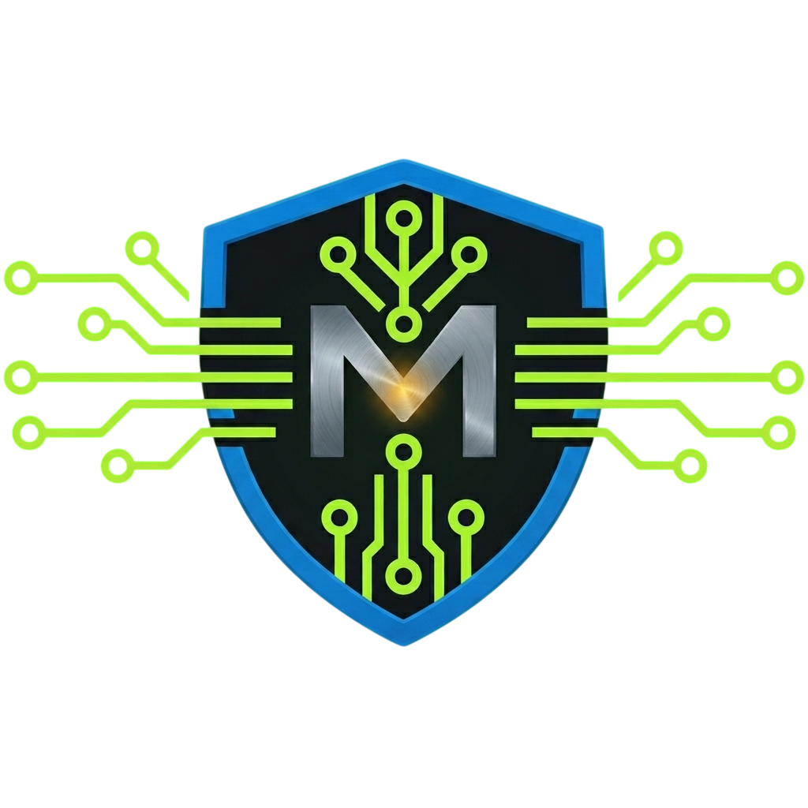

  

<h1 align="center">InovaBot + MultiIA</h1>

  IA aplicada, automação e governança para operações reais.

## O que construímos

A InovaBot desenvolve automações, agentes de IA e integrações para reduzir trabalho manual e dar rastreabilidade à operação. A MultiIA organiza o uso empresarial de IA com processos, papéis, histórico e governança.

Nossas frentes incluem:

- agentes de IA integrados à rotina da equipe;
- automação de processos e atendimento;
- governança de IA, LGPD e trilhas operacionais;
- implantação, treinamento e evolução assistida;
- skills reutilizáveis para o MultiIA Agentes.

## Recursos públicos

- [`skills_clientesMultiIA`](https://github.com/inovabotMultiIA/skills_clientesMultiIA): skills genéricas e sanitizadas para clientes e parceiros.
- [MultiIA](https://multiia.com.br): produtos, agentes, treinamentos e contato comercial.

## Como trabalhamos

1. Mapeamos um processo com início, fim, responsáveis e exceções.
2. Validamos o fluxo antes de automatizar.
3. Implantamos com permissões mínimas e rastreabilidade.
4. Medimos resultado e evoluímos sem perder controle operacional.

## Segurança e privacidade

Repositórios públicos não recebem credenciais, dados de clientes, transcrições, URLs internas ou regras operacionais proprietárias. Conteúdo compartilhável passa por sanitização e revisão antes da publicação.

## Fale com o time

Para avaliar uma automação, um agente ou uma iniciativa de governança de IA, acesse [multiia.com.br](https://multiia.com.br) ou escreva para `contato@multiia.com.br`.

  

